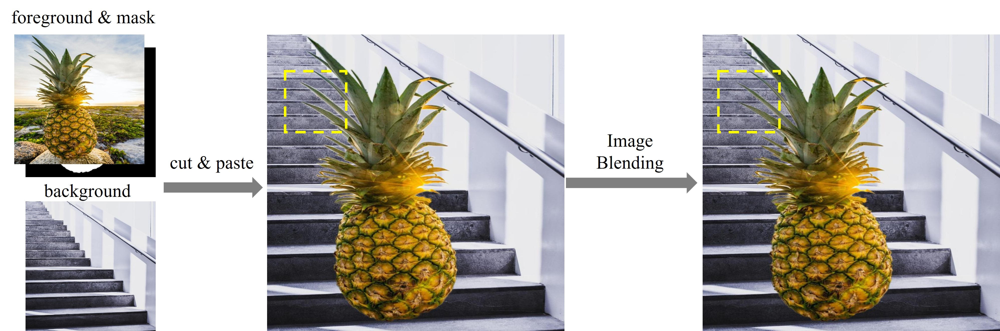

# Awesome-Image-Blending 
 
A curated list of papers, code and resources pertaining to image blending. **Image blending aims to blend the foreground into the background seamlessly by coping with the unnatural boundary between foreground and background.** For more complete resources on general image composition, please refer to [Awesome-Image-Composition](https://github.com/bcmi/Awesome-Image-Composition).

  
  

## Contributing

Contributions are welcome.  If you wish to contribute, feel free to send a pull request. If you have suggestions for new sections to be included, please raise an issue and discuss before sending a pull request.

## Survey

A brief review on image blending is included in the following survey on image composition:

Li Niu, Wenyan Cong, Liu Liu, Yan Hong, Bo Zhang, Jing Liang, Liqing Zhang: "*Making Images Real Again: A Comprehensive Survey on Deep Image Composition.*" arXiv preprint arXiv:2106.14490 (2021). [[arXiv]](https://arxiv.org/pdf/2106.14490.pdf) [[slides]](https://www.ustcnewly.com/download/Image_composition_tutorial.pdf)

## Papers

#### Optimization-based Methods

+ Lingzhi Zhang, Tarmily Wen, Jianbo Shi: "*Deep Image Blending.*" WACV (2020) [[pdf]](https://openaccess.thecvf.com/content_WACV_2020/papers/Zhang_Deep_Image_Blending_WACV_2020_paper.pdf) [[arXiv]](https://arxiv.org/pdf/1910.11495.pdf) [[code]](https://github.com/owenzlz/DeepImageBlending)
+ Huikai Wu, Shuai Zheng, Junge Zhang, Kaiqi Huang: "*GP-GAN: Towards Realistic High-Resolution Image Blending.*" ACM MM (2019) [[arXiv]](https://arxiv.org/pdf/1703.07195.pdf) [[code]](https://github.com/wuhuikai/GP-GAN)

#### Feed-forward Methods
+ Bo Zhang, Yuxuan Duan, Jun Lan, Yan Hong, Huijia Zhu, Weiqiang Wang, Li Niu: "*ControlCom: Controllable Image Composition using Diffusion Model.*" arXiv preprint arXiv:2308.10040 (2023) [[arXiv]](https://arxiv.org/pdf/2308.10040.pdf) [[code]](https://github.com/bcmi/ControlCom-Image-Composition) [[demo]](https://bcmi.sjtu.edu.cn/home/niuli/demo_image_composition/)
+ Shuo Wang, Weijie Lv, Xinyuan Zhao, Xinyu Zhang, Junyu Su, Long Zeng: "*Refined-mask guided multi-stream blending network.*" Multimedia Tools and Applications (2023) [[pdf]](https://link.springer.com/article/10.1007/s11042-023-17793-6)
+ Yazhou Xing, Yu Li, Xintao Wang, Ye Zhu, Qifeng Chen: "*Composite photograph harmonization with complete background cues.*" ACM MM (2022) [[pdf]](https://dl.acm.org/doi/pdf/10.1145/3503161.3548031)
+ He Zhang, Jianming Zhang, Federico Perazzi, Zhe Lin, Vishal M. Patel: "*Deep Image Compositing.*" WACV (2021) [[pdf]](https://arxiv.org/pdf/2011.02146.pdf)

